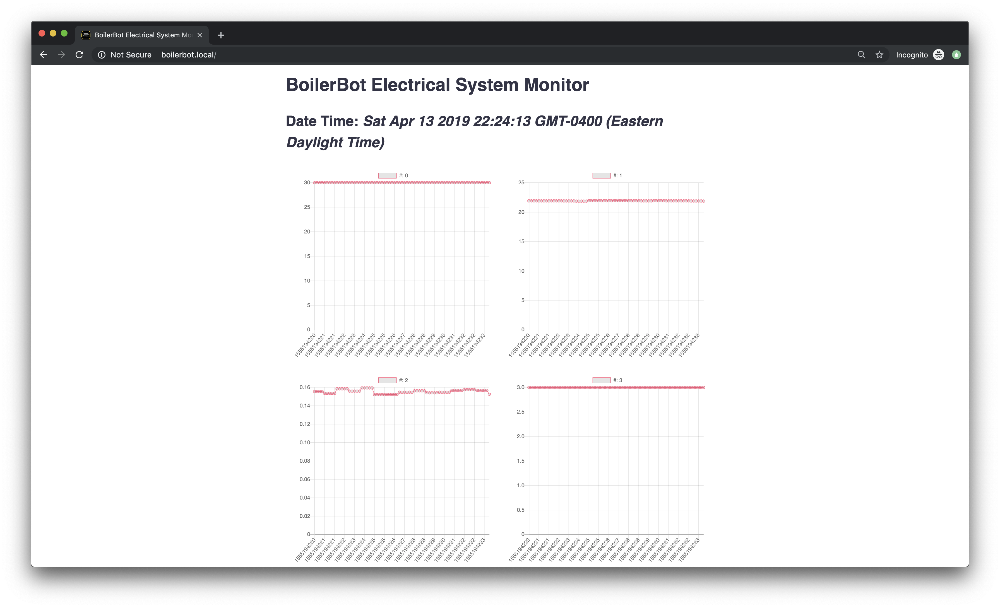

# BoilerBot Electrical System Monitor v0.0.1a

This folder contians the source code for BoilerBot electrical system monitor, which is consisted of two components: sensor data collection and web interface.

The sensors the system will receive data from include:
  1. 6x [VL53L0X Time of Flight Distance sensor](https://www.adafruit.com/product/3317)
    1. 1x Measure the vertical distance between the climber and the ground
    2. 2x Measure the forward distance between the robot and the island
    3. 1x Rear Forward distance measurement
       1. Check when should robot lift rear leg 
    4. 2x Grapping arm distance sensing
       1. Check whether grabed armor box
 1. MCP9808 Temperature sensor
 2. PCF8523 RTC module
 3. Battery voltage analog input
 4. Battery current analog input
 5. Supercapacitor voltage analog input

After finish reading data from sensors, the mcu will packet all of the result into a custom struct with the following format, serialize it using `union`, and broadcast it on the websocket channel to be displayed on web interface.

    struct Measurement
    {
      uint32_t timestamp;
      float vbatt;
      float vcap;
      float ibatt;
      float tempC;
      bool ableBoost;
      float vertiDist;
      float leftDist;
      float rightDist;
      float rearDist;
      float leftGrabDist;
      float rightGrabDist;
      bool isLeftClaw;
      bool isRightClaw;
    };

Meanwhiile, this data buffer will also be stored to microsd card in a file named with the time and date the board power on and its content can be decoded using the decoder python script under the `utils/` foler.

The web interface part mainly provides graphical representation of the sensor values and access to on board log files. In addition, it also provides simple setting to the system like configuring SSID and password or sensor sensitivity. It can be accessed by connecting to the WiFi of the on board ESP32 (`BoilerBot_TYPE_NUM`) and then one can visit `boilerbot.local/` or `192.168.4.1` for the interface.

## Usage

1. Install Arduino IDE 
2. For VSCode development
      1. Open `.code-workspace` configuration file
      2. Or install Arduino extension by Microsoft
3. Install ESP32 board in Arduino IDE [here](https://github.com/espressif/arduino-esp32/blob/master/docs/arduino-ide/boards_manager.md)
      1. For vscode
         1. Use Board manager of the arduino extension
         2. Press `ctrl/cmd + Shift + P` and type `arduino board manager`
         3. Search `ESP32` and install it
4. Install CP2102 Driver (or other kinds, depend on your chip) for USB2UART
5. Install necessary third-party library
     1. [ESPAsyncWebServer](https://github.com/me-no-dev/ESPAsyncWebServer#installation)
     2. [AsyncTCP](https://github.com/me-no-dev/AsyncTCP)
     3. Adafruit_MCP9808
     4. RTClib
     5. Adafruit_SSD1306
     6. VL53L0X by pololu
6. Configure include path for vscode
      1. Open `.code-workspace` configuration file
      2. Modify the path so that they match your computer's setting
      3. [ ] Todo: use system path?
7. Compile and upload `global.ino` to the ESP32

## Todos

### Functionality Test from Power Dis
- [ ] Control of Relay (Cap or not)
- [x] Temperature Read
- [ ] Current Read (I2C)
- [ ] Read of battery voltage (I2C)

### Functionality Test from Controller Board
- [x] Able to Program
- [x] Able to reset
- [x] SD read and write
- [ ] MCP2300x Testing
- [ ] TCA9548A
- [x] Timer
- [ ] System Stability Test (Connect all peripheral)
- [ ] Buzzer (DJI)
- [ ] All I2C peripherals
- [ ] Digital limit switch
- [ ] UART Protocols to STM32F4
- [ ] UART Protocols to STM32F3

### Updates Power Dis
- [ ] Check Relay
- [ ] Check Switch by pass

### Update Super Capacitor Charging Board
- [ ] Read of all voltage
- [ ] Read of all current
- [ ] UART all functionality
- [ ] PID

* Sensors
  * [x] Data Logging
  * [ ] Handle sensor disconnection
  * Sensors reading
  * Use led to indicate status and error
* Serial
  * Create debug port?
  * Bluetooth Lib too big [Solution](https://github.com/SensorsIot/Bluetooth-BLE-on-Arduino-IDE/issues/3)
* Threading issue?
* Web
  * Speed increasing?
  * Turn off animation
  * Log
    * Log file management
    * Log file download
    * Log file plotting
      * [ESP32 SD Flush not working](https://github.com/espressif/arduino-esp32/issues/1293), use newest release version
  * Reconnection button
  * Status
  * setting
    * Set mode of system
    * Set ssid, pass, hostname (eeprom)
  * Embed css and js files to avoid running out of mem?
* Extendability
  * Able to use in the next season
* API Explanation
* `/`
  * Handle logging chart display
* `/log`
  * Provide logging file downloads 
* `/status`
  * Whether each module is online or not
* `/setting`
  * Mode selection
    * Super cap MODE
    * mix mode
    * battery only mode
* WebSocket Event
  * connect
    * server broadcast current sensor data to this client
  * disconnect
    * cleanup
  * data
    * sensor data
* Library
  * Better include method
* Performance check

## Contributors

Charlotte Huang, Roshni Sarma, Megan Singer, William An